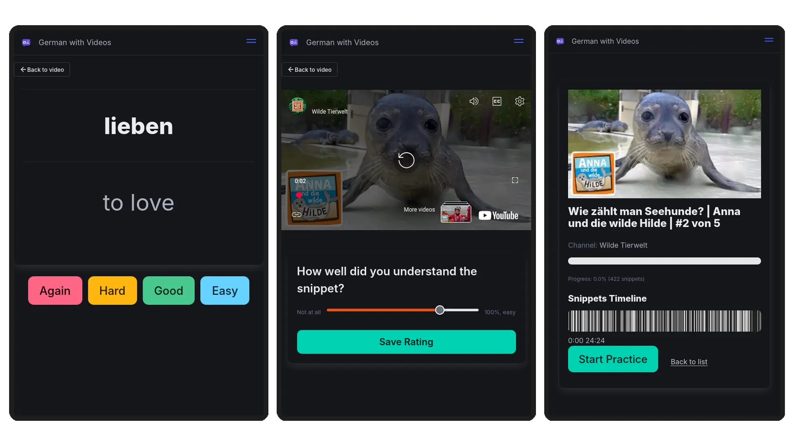

# SnipVocab

## Running it

- Go into `venv`, `LANGUAGE_TO_LEARN=ar python manage.py runserver 8081` or `LANGUAGE_TO_LEARN=de python manage.py runserver 8081`
  - (the port being `8001` only matters for my local system)

### Deployment

Deploys to two heroku apps, one for de, one for ar. Simply run `./deploy.sh`, or `./deploy.sh --no-fixture` if you didn't change anything data-related

## Testing

Tests are few, but automatically run in pre-commit